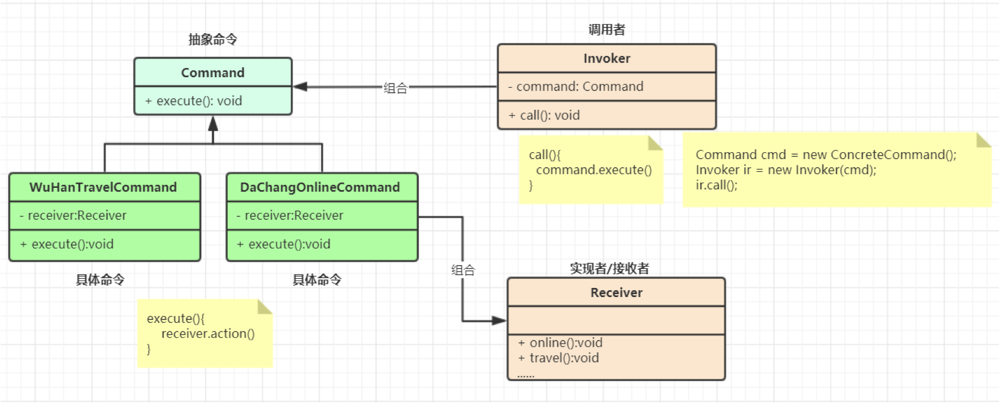
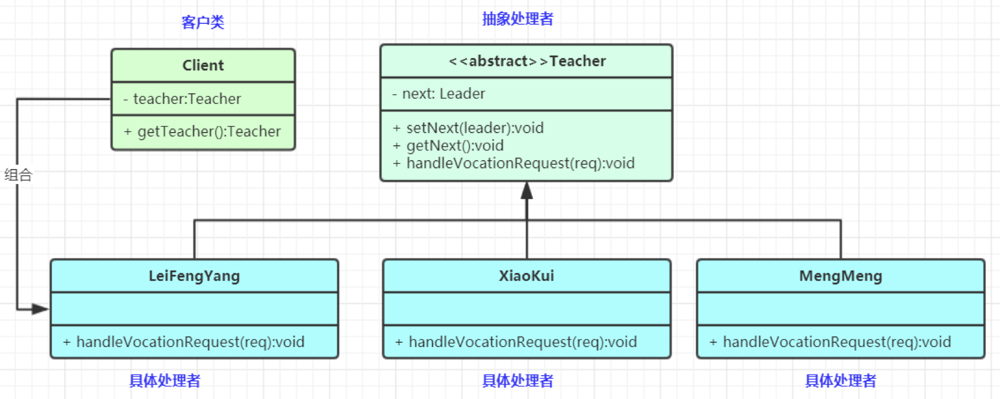
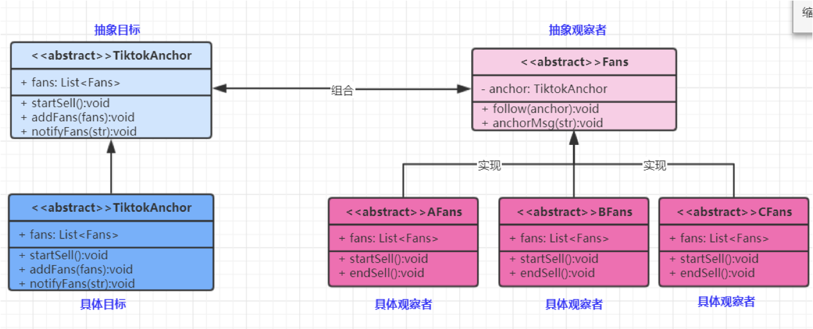
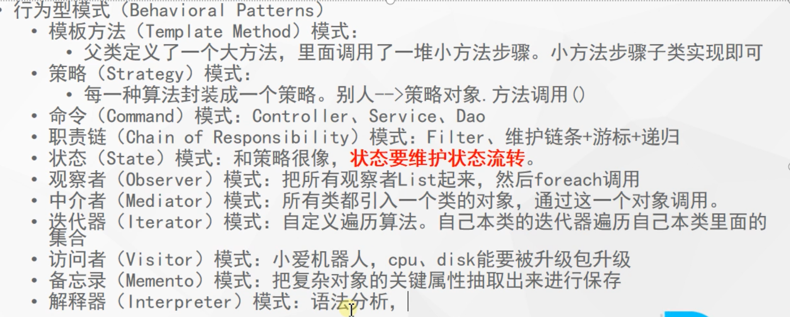

# 设计模式

（需配合代码学习design目录）

### 一、设计模式总览

加黑的为重要的设计模式

#### 1.1  组件的定义：创建型模式（Creational Patterns）

* **单例（Singleton）模式**

* 原型（Prototype）模式

* **工厂方法（FactoryMethod）模式**

* **抽象工厂（AbstractFactory）模式**

* **建造者（Builder）模式**

#### 1.2 组件的创建：结构型模式（Structural Patterns）

* **代理（Proxy）模式**

* **适配器（Adapter）模式**

* 桥接（Bridge）模式

* **装饰（Decorator）模式**

* **外观（Facade）模式**

* 享元（Flyweight）模式

* **组合（Composite）模式**

* 过滤器模式（Filter Pattern）

#### 1.3 组件的服役：行为型模式（Behavioral Patterns）

* **模板方法（Template Method）模式**

* **策略（Strategy）模式**

* 命令（Command）模式

* 职责链（Chain of Responsibility）模式

* **状态（State）模式**

* **观察者（Observer）模式**

* 中介者（Mediator）模式

* **迭代器（Iterator）模式**

* 访问者（Visitor）模式

* 备忘录（Memento）模式

* 解释器（Interpreter）模式

#### 1.4 设计的7大原则

（1）开闭原则：对扩展开放，对修改关闭。用抽象搭建框架，用实现扩展细节。**扩展新类而不是修改旧类**。

（2）里氏替换原则：继承必须确保超类所拥有的性质在子类中仍然成立。**继承父类而不去改变父类。**

子类可以实现父类的抽象方法，但不能覆盖父类的非抽象方法。子类中可以增加自己独有的方法。

（3）**依赖倒置原则**：高层模块不应该依赖低层模块，两者都应该依赖其抽象；抽象不应该依赖细节，细节应该依赖抽象。**面向接口编程，而不是面向实现类。**

（4）单一职责原则：一个类应该有且仅有一个引起它变化的原因，否则类应该被拆分。**一个类只负责一种职责。**

（5）接口隔离原则：接口设计时尽量细化，不同职责的业务创建不同的接口。**各个类建立自己的专用接口，而不是建立万能接口。**

（6）迪米特法则：一个对象应该对其他对象保持最少的了解，以降低类与类之间的耦合。**无需直接交互的两个类，如果需要交互，使用中间者**。过度使用迪米特法则会使系统产生大量的中介类，从而增加系统的复杂性，使模块之间的通信效率降低。

（7）合成复用原则：软件复用时，要尽量先使用组合或者聚合等关联关系来实现，其次才考虑使用继承关系来实现。**优先组合，其次继承**。

### 二、创建型模式

#### 2.1 创建者模式概述

创建型模式关注点在于”怎样创建出对象？“。将对象的创建与使用分离，**来降低系统的耦合度**。

使用者无需关注对象的创建细节：

* 对象的创建由相关的工厂来完成；（各种工厂模式）

* 对象的创建由一个建造者来完成；（建造者模式）

* 对象的创建由原来对象克隆完成；（原型模式）

* 对象始终在系统中只有一个实例；（单例模式）

#### 2.2 单例模式（Singleton）

**一个单一的类，负责创建自己的对象，同时确保系统中只有单个对象被创建。**

**特点：**（1）构造器私有（2）自己编写实例化逻辑（3）它必须自行向整个系统提供这个实例。

**使用场景：**（1）多线程中的线程池（2）数据库的连接池（3）系统环境信息（3）上下文（ServletContext）

#### 2.3 原型模式（Prototype）

**原型模式：**是用于创建重复的对象，同时又能保证性能。**本体给外部提供一个克隆体进行使用，对克隆体的修改不会改变本体**。

**使用场景：**

（1）资源优化。

（2）性能和安全要求。

（3）一个对象多个修改者的场景。

（4）一个对象需要提供给其他对象访问，而且各个调用者可能都需要修改其值时可以考虑使用原型模式拷贝多个对象供调用者使用。

（5）深克隆（两个完全对象不一样的[递归克隆]，内容却完全一样）、浅克隆（只是属性赋值）....

#### 2.4 工厂模式（Factory）

**工厂模式：提供了一种创建对象的最佳方式**。我们不必关心对象的创建细节，只需要根据不同情况获取不同产品即可。

##### （1）简单工厂(Simple Factory )：静态工厂

依据要创建的对象类型来创建不同的对象。

**主要角色:**

> Factory：工厂角色， WuLinFactory
>
> Product：抽象产品角色，Car
>
> ConcreteProduct：具体产品角色， VanCar、MiniCar

**缺点：违背开闭，扩展不易**

##### （2）工厂方法(Factory Method)：多态工厂

将工厂抽象出来，基于不同的工厂创建不同的对象。

**主要角色:**

> Product：抽象产品
>
> ConcreteProduct：具体产品
>
> Factory：抽象工厂
>
> ConcreteFactory：具体工厂

**缺点：系统复杂度增加，产品单一**

##### （3）抽象工厂(Abstract Factory)

**工厂模式的退化：**当抽象工厂模式中**每一个具体工厂类只创建一个产品对象**，也就是只存在一个产品等级结构时，**抽象工厂模式退化成工厂方法模式**；当工厂方法模式中抽象工厂与具体工厂合并，提供一个统一的工厂来创建产品对象，并将创建对象的工厂方法设计为静态方法时，**工厂方法模式退化成简单工厂模式**。

**使用场景：**

（1）NumberFormat、SimpleDateFormat

（2）LoggerFactory

（3）SqlSessionFactory：MyBatis

（4）BeanFactory：Spring的BeanFactory（就是为了造出bean）

#### 2.5 建造者模式

创建的东西细节复杂，还必须暴露给使用者。屏蔽过程而不屏蔽细节。注意Builder中的方法返回值是当前对象。

>**产品角色（Product）**：Phone
>
>**抽象建造者（Builder）**：AbstracPhoneBuilder
>
>**具体建造者(Concrete Builder）**：PhoneBuilder

**使用场景：**

（1）StringBuilder：append();  

（2）Swagger-ApiBuilder

（3）快速实现：Lombok-Builder模式

### 三、结构型模式

#### 2.1 结构型模式概述

**结构型模式**关注点“怎样组合对象/类？”

* **类结构型模式**关心类的组合，由多个类可以组合成一个更大的（继承）

* **对象结构型模式**关心类与对象的组合，通过关联关系在一个类中定义另一个类的实例对象（组合）

根据“**合成复用原则**”，在系统中尽量**使用关联关系来替代继承关系**，因此大部分结构型模式都是对象结构型模式。

#### 2.2 适配器模式（Adapter）

**两个不兼容接口之间适配的桥梁。**通过适配器进行适配，进行中间转换的操作，承上启下。

**适配器模式：**将一个接口**转换**成客户希望的另一个接口，适配器模式使接口不兼容的那些类可以一起工作，适配器模式分为类结构型模式（继承）和对象结构型模式（组合）两种，前者（继承）类之间的耦合度比后者高，且要求程序员了解现有组件库中的相关组件的内部结构，所以应用相对较少些。

**主要角色:**

> **目标（Target）接口**：可以是抽象类或接口。客户希望直接用的接口。
>
> **适配者（Adaptee）类**：隐藏的转换接口。
>
> **适配器（Adapter）类**：它是一个转换器，通过继承或引用适配者的对象，把适配者接口转换成目标接口。

**类结构型模式：**

**对象结构型模式：**

**使用场景：**

（1）Tomcat如何将Request流转为标准Request。

（2）Spring AOP中的AdvisorAdapter。

（3）Spring MVC中经典的HandlerAdapter。

（4）SpringBoot 中 WebMvcConfigurerAdapter。

#### 2.3 桥接模式（Bridge）

**相同功能抽象化与实现化解耦，抽象与实现可以独立升级。**把真正会引起此类变化的一个维度直接抽取出来，通过组合的方式接起来。

**桥接模式：将继承转为关联，降低类之间的耦合度，减少代码量。**

在现实生活中，某些类具有两个或多个维度的变化，如图形既可按形状分，又可按颜色分。如何设计类似于 Photoshop 这样的软件，能画不同形状和不同颜色的图形呢？如果用继承方式，m 种形状和 n 种颜色的图形就有 m×n 种，不但对应的子类很多，而且扩展困难。不同颜色和字体的文字、不同品牌和功率的汽车。

**主要角色:**

> **抽象化（Abstraction）角色**：定义抽象类，并包含一个对实现化对象的引用。
>
> **扩展抽象化（Refined Abstraction）角色**：是抽象化角色的子类，实现父类中的业务方法，并通过组合关系调用实现化角色中的业务方法。
>
> **实现化（Implementor）角色**：定义实现化角色的接口，供扩展抽象化角色调用。
>
> **具体实现化（Concrete Implementor）角色**：给出实现化角色接口的具体实现。

**使用场景：**

（1）当一个类存在两个独立变化的维度，且这两个维度都需要进行扩展时。

（2）当一个系统不希望使用继承或因为多层次继承导致系统类的个数急剧增加时。

（3）当一个系统需要在构件的抽象化角色和具体化角色之间增加更多的灵活性时。

#### 2.4 装饰器模式（Decorator/Wrapper）

**向一个现有的对象添加新的功能，同时又不改变其结构。**

创建了一个装饰类，用来包装原有的类，并在保持类方法签名完整性的前提下，提供了额外的功能。

**主要角色:**

> 抽象构件（Component）角色：定义一个抽象接口以规范准备接收附加责任的对象。
>
> 具体构件（ConcreteComponent）角色：实现抽象构件，通过装饰角色为其添加一些职责。
>
> 抽象装饰（Decorator）角色：继承抽象构件，并包含具体构件的实例，可以通过其子类扩展具体构件的功能。
>
> 具体装饰（ConcreteDecorator）角色：实现抽象装饰的相关方法，并给具体构件对象添加附加的责任。

**使用场景：**

（1）已存在的类，某一天某个功能使用的时候发现不够用，就可以使用装饰器。

（2）SpringSession中如何进行session与redis关联？HttpRequestWrapper

（3）MyBatisPlus提取了QueryWrapper。

（4）Spring中的BeanWrapper是做什么？

（5）Spring Webflux中的 WebHandlerDecorator。

#### 2.5 代理模式（Proxy）

**一个类代表另一个类的功能。**

**代理模式：** 给某一个对象提供一个代理，并由代理对象控制对原对象的引用，对象结构型模式。这种也是静态代理。

**主要角色:**

> Subject: 抽象主体角色(抽象类或接口)
>
> Proxy: 代理主体角色(代理对象类)
>
> RealSubject: 真实主体角色(被代理对象类)

（1）静态代理：静态代理是装饰器模式。

（2）动态代理：万能代理类。

* JDK动态代理

* cglib动态代理

**使用场景：**

（1）MyBatis的mapper到底是什么？动态代理，UserMapper等，MyBatis帮我们实现MapperProxy。

（2）Seata的DataSourceProxy。

（3）Druid的DataSource存在的Proxy模式。

#### 2.6 过滤器模式（Filter、Criteria）

**使用不同的标准来过滤一组对象。**

#### 2.7 组合模式（Composite）

**相似对象进行组合，形成树形结构。**Object -> List\<Object>

**使用场景：**

（1）层级结构

（2）部门组织结构

#### 2.8 外观模式（Facade）

向现有的系统添加一个接口，客户端访问此接口来隐藏系统的复杂性。

外观（Facade）模式又叫作门面模式，**是一种通过为多个复杂的子系统提供一个一致的接口**，而使这些子系统更加容易被访问的模式。

**使用场景：**

（1）JAVA 的三层开发模式。类似于Service层调用不同的依赖注入实现对象。

（2）分布式系统的网关。

（3）Tomcat源码中的RequestFacade。

#### 2.9 享元模式（Flyweight）

**尝试重用现有的同类对象，如果未找到匹配的对象，则创建新对象。**

在享元模式中**可以共享的相同内容称为内部状态**(IntrinsicState)，而那些需要外部环境来设置的**不能共享的内容称为外部状态**(Extrinsic State)，由于区分了内部状态和外部状态，因此可以通过设置不同的外部状态使得相同的对象可以具有一些不同的特征，而相同的内部状态是可以共享的。

在享元模式中通常会出现工厂模式，需要创建一个**享元工厂来负责维护一个享元池**（Flyweight Pool）用于存储具有相同内部状态的享元对象。

> 享元模式包含如下角色：
>
> Flyweight: 抽象享元类 
>
> ConcreteFlyweight: 具体享元类 
>
> UnsharedConcreteFlyweight: 非共享具体享元类 
>
> FlyweightFactory: 享元工厂类 简单工厂

初始化加载很多User对象，形成对象池。

### 四、行为型模式

#### 4.1 行为型模式概述

行为型模式关注点“怎样运行对象/类？”所以我们关注下类/对象的运行时流程控制。行为型模式描述多个类或对象之间怎样相互协作共同完成单个对象都无法单独完成的任务，它涉及算法与对象间职责的分配。

行为型模式分为**类行为模式**和**对象行为模式**，前者采用继承机制来在类间分派行为，后者采用组合或聚合在对象间分配行为。由于组合关系或聚合关系比继承关系耦合度低，满足“合成复用原则”，所以对象行为模式比类行为模式具有更大的灵活性。

* 除了**模板方法模式**和**解释器模式**是**类行为型模式**，**其他**的全部属于**对象行为型模式**。

#### 4.2 模板方法（Template Method）模式

**父类定义算法骨架，某些实现放在子类。**

**模板方法模式**：一个抽象类公开定义了执行它的方法的方式模板。它的子类可以按需要重写方法实现，但调用将以抽象类中定义的方式进行。

**主要角色:**

> 模板方法（Template Method）包含两个角色：
>
> 抽象类/抽象模板（Abstract Class）
>
> 具体子类/具体实现（Concrete Class）

**使用场景：**

（1）Spring的整个继承体系都基本用到模板方法。

（2）JdbcTemplate、RedisTemplate都允许我们再扩展。

#### 4.3 策略（Strategy）模式

**每种算法独立封装，根据不同情况使用不同算法策略。**

**策略模式：**定义了一系列算法，并将每个算法封装起来，使它们可以相互替换，且算法的变化不会影响使用算法的客户。属于对象行为模式。

**主要角色:**

> **抽象策略（Strategy）类**：公共接口，各种不同的算法以不同的方式实现这个接口，环境角色使用这个接口调用不同的算法，一般使用接口或抽象类实现。
>
> **具体策略（Concrete Strategy）类**：实现了抽象策略定义的接口，提供具体的算法实现。
>
> **环境（Context）类**：持有一个策略类的引用，最终给客户端调用。

**使用场景：**

（1）使用策略模式可以避免使用多重条件语句，如 if...else 语句、switch...case 语句。

（2）Spring的 InstantiationStrategy。

（3）线程池拒绝策略。

#### 4.4 状态（State）模式

**每种状态独立封装，不同状态内部封装了不同行为。**

**状态模式：**对有状态的对象，把复杂的“判断逻辑”提取到不同的状态对象中，允许状态对象在其内部状态发生改变时改变其行为。

**主要角色:**

> **环境类（Context）角色**：也称为上下文，它定义了客户端需要的接口，内部维护一个当前状态，并负责具体状态的切换。
>
> **抽象状态（State）角色**：定义一个接口，用以封装环境对象中的特定状态所对应的行为，可以有一个或多个行为。
>
> **具体状态（Concrete State）角色**：实现抽象状态所对应的行为，并且在需要的情况下进行状态切换。

**使用场景：**

（1）流程框架与状态机

（2）相比策略模式多了状态的切换。

#### 4.5 命令（Command）模式

**将一个请求封装为一个对象，使发出请求的责任和执行请求的责任分割开。**（Controller->Service->Dao）

**命令模式：**将一个请求封装为一个对象，使发出请求的责任和执行请求的责任分割开。这样两者之间通过命令对象进行沟通，这样方便将命令对象进行储存、传递、调用、增加与管理。

**主要角色:**

> 抽象命令类（Command）角色：声明执行命令的接口，拥有执行命令的抽象方法 execute()。
>
> 具体命令类（Concrete Command）角色：是抽象命令类的具体实现类，它拥有接收者对象，并通过调用接收者的功能来完成命令要执行的操作。
>
> 实现者/接收者（Receiver）角色：执行命令功能的相关操作，是具体命令对象业务的真正实现者。
>
> 调用者/请求者（Invoker）角色：是请求的发送者，它通常拥有很多的命令对象，并通过访问命令对象来执行相关请求，它不直接访问接收者。

**使用场景：**

（1）mvc就是典型的命令模式。

（2）当系统需要执行一组操作时，命令模式可以定义宏命令（一个命令组合了多个命令）来实现该功能。

#### 4.6 职责链（Chain of Responsibility）模式

**所有处理者封装为链式结构，依次调用。**

**责任链模式：**为了避免请求发送者与多个请求处理者耦合在一起，于是将所有请求的处理者通过前一对象记住其下一个对象的引用而连成一条链；当有请求发生时，可将请求沿着这条链传递，直到有对象处理它为止。属于对象行为型模式。

**主要角色:**

> 抽象处理者（Handler）角色：定义一个处理请求的接口，包含抽象处理方法和一个后继连接。
>
> 具体处理者（Concrete Handler）角色：实现抽象处理者的处理方法，判断能否处理本次请求，如果可以处理请求则处理，否则将该请求转给它的后继者。
>
> 客户类（Client）角色：创建处理链，并向链头的具体处理者对象提交请求，它不关心处理细节和请求的传递过程。

**使用场景：**

（1）Tomcat的Pipeline、Valve

（2）Filter链

（3）Aop责任链

#### 4.7 备忘录（Memento）模式

**把核心信息抽取出来，可以进行保存。**

**备忘录模式：**在不破坏封装性的前提下，捕获一个对象的内部状态，并在该对象之外保存这个状态，以便以后当需要时能将该对象恢复到原先保存的状态。该模式又叫快照模式。对象行为型模式。

**主要角色:**

> 发起人（Originator）角色：记录当前时刻的内部状态信息，提供创建备忘录和恢复备忘录数据的功能，实现其他业务功能，它可以访问备忘录里的所有信息。
>
> 备忘录（Memento）角色：负责存储发起人的内部状态，在需要的时候提供这些内部状态给发起人。
>
> 管理者（Caretaker）角色：对备忘录进行管理，提供保存与获取备忘录的功能，但其不能对备忘录的内容进行访问与修改。

**使用场景：**

（1）游戏存档。

（2）数据库保存点事务（savepoint）。

（3）session活化钝化。

#### 4.8 解释器（Interpreter）模式

**定义语法解析规则。**

**解释器模式：**给**分析对象定义一个语言**，并**定义该语言的文法表示**，再**设计一个解析器**来**解释语言中的句子**。也就是说，用编译语言的方式来分析应用中的实例。这种模式实现了文法表达式处理的接口，该接口解释一个特定的上下文。类行为型模式。

**主要角色:**

> * 抽象表达式（Abstract Expression）角色：定义解释器的接口，约定解释器的解释操作，主要包含解释方法 interpret()。
>
> * 终结符表达式（Terminal Expression）角色：是抽象表达式的子类，用来实现文法中与终结符相关的操作，文法中的每一个终结符都有一个具体终结表达式与之相对应。
>
> * 非终结符表达式（Nonterminal Expression）角色：也是抽象表达式的子类，用来实现文法中与非终结符相关的操作，文法中的每条规则都对应于一个非终结符表达式。
>
> * 环境（Context）角色：通常包含各个解释器需要的数据或是公共的功能，一般用来传递被所有解释器共享的数据，后面的解释器可以从这里获取这些值。
>
> * 客户端（Client）：主要任务是将需要分析的句子或表达式转换成使用解释器对象描述的抽象语法树，然后调用解释器的解释方法，当然也可以通过环境角色间接访问解释器的解释方法。

**使用场景：**

（1）Spring的表达式解析：#{}

（2）Thymeleaf等模板引擎的语法解析

（3）编译原理

#### 4.9 观察者（Observer）模式

**维护多个观察者依赖，状态变化通知所有观察者。**

**观察者模式：**定义对象间的一种**一对多依赖关系**，使得每**当一个对象状态发生改变**时，其相关**依赖对象皆得到通知**并被**自动更新**。观察者模式又叫做发布-订阅（Publish/Subscribe）模式、模型-视图（Model/View）模式、源-监听器（Source/Listener）模式或从属者（Dependents）模式。对象行为型模式

**主要角色:**

> Subject: 目标
>
> ConcreteSubject: 具体目标
>
> Observer: 观察者
>
> ConcreteObserver: 具体观察者

**使用场景：**

（1）Spring事件机制

（2）Vue的双向绑定核心

（3）响应式编程核心思想

#### 4.10 中介者（Mediator）模式

**取消类/对象的直接调用关系，使用中介者维护。**

**中介者模式：用一个中介对象来封装一系列的对象交互，中介者使各对象不需要显式地相互引用，减少对象间混乱的依赖关系，从而使其耦合松散，而且可以独立地改变它们之间的交互。对象行为型模式。

**主要角色:**

> Mediator: 抽象中介者
>
> ConcreteMediator: 具体中介者
>
> Colleague: 抽象同事类
>
> ConcreteColleague: 具体同事类

**使用场景：**

（1）SpringMVC 的 DispatcherServlet是一个中介者，会提取Controller、Model、View来进行调用。而无需controller直接调用view之类的渲染方法

（2）分布式系统中的网

#### 4.11 迭代器（Iterator）模式

**定义集合数据的遍历规则。**

**迭代器模式：**提供一个对象(迭代器)来顺序访问聚合对象(迭代数据)中的一系列数据，而不暴露聚合对象的内部表示。对象行为型模式。

**主要角色:**

> 抽象聚合（Aggregate）角色：定义存储、添加、删除聚合对象以及创建迭代器对象的接口。
>
> 具体聚合（ConcreteAggregate）角色：实现抽象聚合类，返回一个具体迭代器的实例。
>
> 抽象迭代器（Iterator）角色：定义访问和遍历聚合元素的接口，通常包含 hasNext()、first()、next() 等方法。
>
> 具体迭代器（Concretelterator）角色：实现抽象迭代器接口中所定义的方法，完成对聚合对象的遍历，记录遍历的当前位置。

**使用场景：**

（1）jdk容器接口的Iterator定义。

（2）现实开发中，我们几乎无需编写迭代器，基本数据结构链表、树、图的迭代器已经都有了。除非要重写迭代逻辑。

#### 4.12 访问者（Visitor）模式

**分离对象结构，与元素的执行算法。**

**访问者模式：**将作用于某种数据结构中的各元素的操作分离出来封装成独立的类，使其在不改变数据结构的前提下可以添加作用于这些元素的新的操作，为数据结构中的每个元素提供多种访问方式。它将对数据的操作与数据结构进行分离，是行为类模式中最复杂的一种模式。

**主要角色:**

> 抽象访问者（Visitor）角色：定义一个访问具体元素的接口，为每个具体元素类对应一个访问操作 visit() ，该操作中的参数类型标识了被访问的具体元素。
>
> 具体访问者（ConcreteVisitor）角色：实现抽象访问者角色中声明的各个访问操作，确定访问者访问一个元素时该做什么。
>
> 抽象元素（Element）角色：声明一个包含接受操作 accept() 的接口，被接受的访问者对象作为 accept() 方法的参数。
>
> 具体元素（ConcreteElement）角色：实现抽象元素角色提供的 accept() 操作，其方法体通常都是 visitor.visit(this) ，另外具体元素中可能还包含本身业务逻辑的相关操作。
>
> 对象结构（Object Structure）角色：是一个包含元素角色的容器，提供让访问者对象遍历容器中的所有元素的方法，通常由 List、Set、Map 等聚合类实现。

**使用场景：**

（1）在访问者模式中，每增加一个新的元素类，都要在每一个具体访问者类中增加相应的具体操作，这违背了“开闭原则”。违反依赖倒置原则。访问者模式依赖了具体类，而没有依赖抽象类。破坏封装。访问者模式中具体元素对访问者公布细节，这破坏了对象的封装性

（2）应用于对象结构相对稳定，但其操作算法经常变化的程序。

（2）Spring反射工具中的MethodVisitor

### 五、一句话总结

